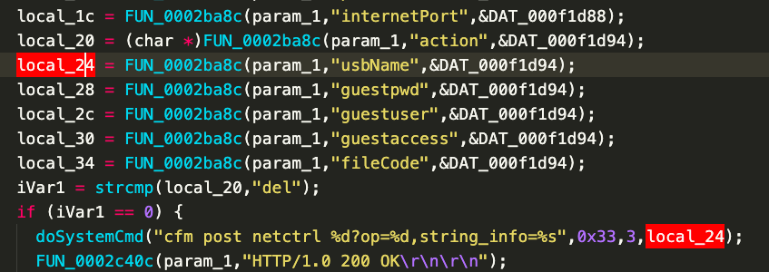

## Tenda AC18 stack overflow vulnerability

## 1. Affected version
V15.03.05.19

Firmware download website: https://www.tenda.com.cn/download/detail-2610.html

## 2. Vulnerability details

In the Tenda AC18 V15.03.05.19 firmware, a command injection vulnerability was identified in the formSetSambaConf function. The local_24 variable retrieves the usbName parameter from a POST request and passes it directly to the doSystemCmd function without proper input validation. This flaw allows an attacker to 
execute arbitrary commands by supplying a malicious usbName value, leading to potential remote command execution.

   

