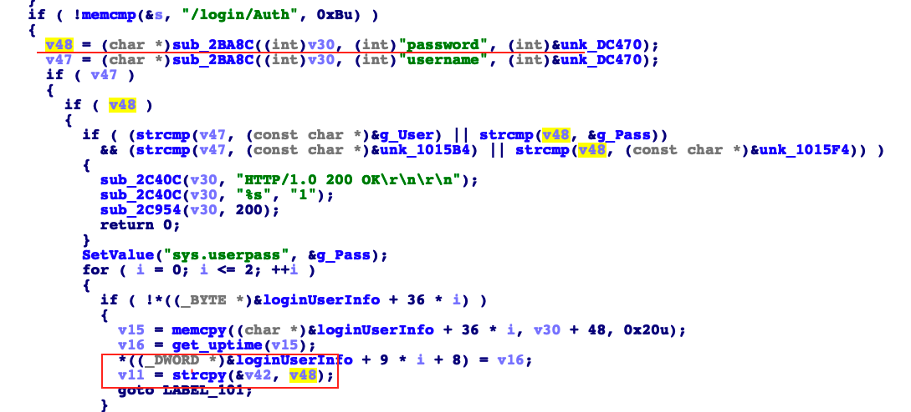

## Tenda AC18 stack overflow vulnerability

## 1. Affected version
V15.03.05.19

Firmware download website: https://www.tenda.com.cn/download/detail-2610.html

## 2. Vulnerability details
   In the function R7WebsSecurityHandler handling the "password" parameter in httpd , it assigns the value obtained from the sub_2BA8C function to the v48 variable. The program directly copies the content of v48 into v42, using the strcpy function. However, no size validation is performed on the content of v48 before the copying operation.
Since strcpy does not limit the length of the copied data, an attacker can supply a crafted "password" parameter with a length exceeding the size of the stack buffers, leading to a stack-based buffer overflow. This vulnerability can result in Denial of Service (DoS) by overwriting critical stack memory with controlled data.

   

