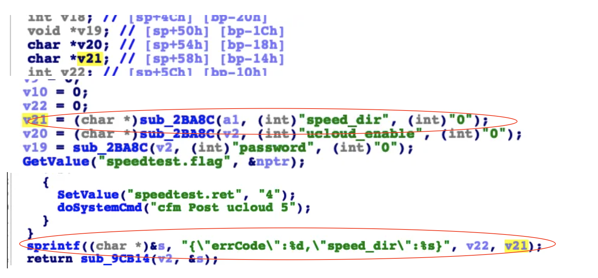

## Tenda AC18 stack overflow vulnerability

## 1. Affected version
V15.03.05.19

## 2. Vulnerability details
  A stack overflow vulnerability exists in the formSetSpeedWan function of the Tenda AC18 V15.03.05.019 firmware. The v21 variable retrieves the speed_dir parameter from a POST request without proper validation. This value is directly used as an argument in a sprintf function to populate a local variable on the stack.

An attacker can supply a crafted speed_dir parameter to overflow the stack buffer, causing the affected function or the entire device to crash. This vulnerability can be triggered remotely by an unauthenticated attacker, resulting in a denial-of-service (DoS) condition.
   

