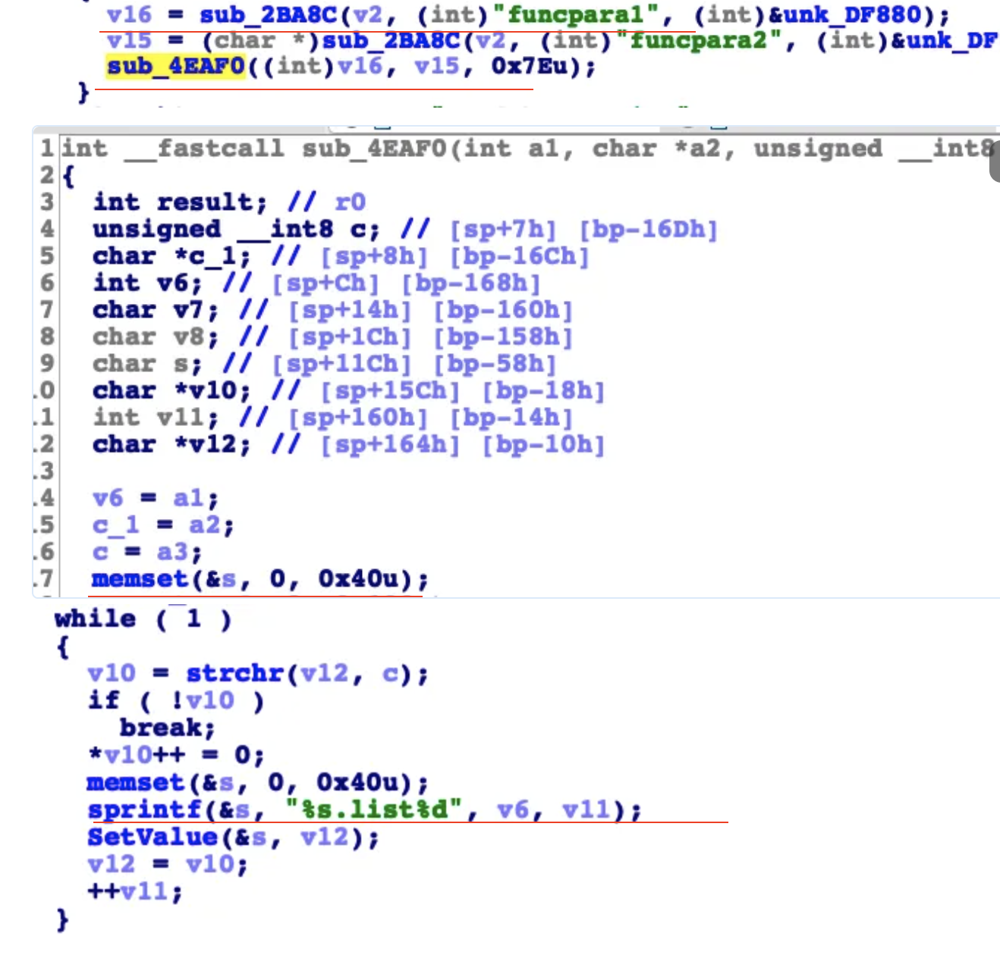

## Tenda AC18 stack overflow vulnerability

## 1. Affected version
V15.03.05.19

## 2. Vulnerability details
A stack overflow vulnerability exists in the formSetCfm and sub_4EAF0 functions of the Tenda A18 V15.03.05.19 firmware. The formSetCfm function retrieves the funcpara1 parameter from a POST request and passes it directly to the sub_4EAF0 function without proper input validation.

Within the sub_4EAF0 function, the local array s is statically allocated with a size of 64 bytes. The function uses sprintf(s, "%s.list%d", v6, v11) to format and store a string in the s buffer. However, because the user has full control over the funcpara1 input, an attacker can supply a crafted funcpara1 parameter that exceeds the capacity of the s array, resulting in a buffer overflow.

This vulnerability can be exploited remotely by an unauthenticated attacker, potentially leading to a denial-of-service (DoS) condition by crashing the affected function or enabling arbitrary code execution, compromising the security and functionality of the device.
   
   

