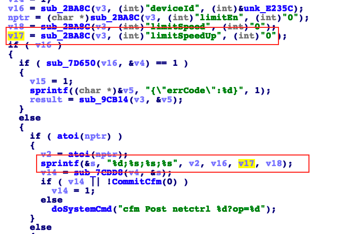

## Tenda AC18 stack overflow vulnerability

## 1. Affected version
V15.03.05.19

Firmware download website: https://www.tenda.com.cn/download/detail-2610.html

## 2. Vulnerability details

A stack overflow vulnerability exists in the formSetClientState function of the Tenda AC18 V15.03.05.19 firmware. The v17 variable retrieves the limitSpeedUp parameter from a POST request without adequate input validation.

This parameter is directly passed to a sprintf function, which writes the formatted string into a local stack-based buffer. If the user-provided limitSpeedUp value exceeds the buffer's capacity, it can overwrite the return address of the function, leading to a stack overflow.

This vulnerability can be exploited by an unauthenticated attacker to trigger a denial-of-service (DoS) condition or potentially execute arbitrary code on the device, compromising its security and functionality.
   
